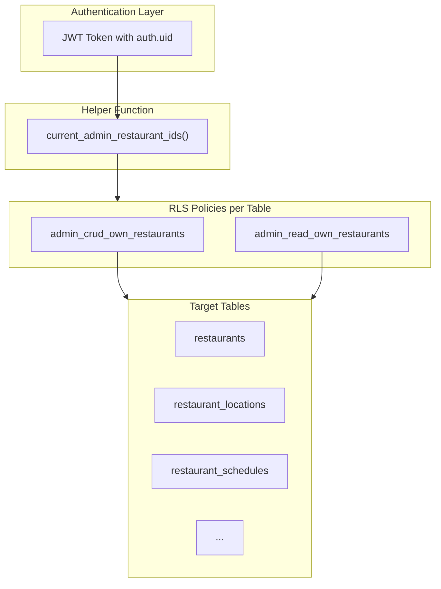

# Restaurant Admin Access Control Plan

## Current State Analysis

### Tables Requiring Access (18 total)

| Table | RLS Enabled | Current Admin Policy | Rows |

|-------|-------------|---------------------|------|

| `restaurants` | Yes | None (public read + service_role) | 186 |

| `restaurant_locations` | Yes | None (service_role only) | 186 |

| `restaurant_domains` | Yes | None (service_role only) | 273 |

| `restaurant_subdomains` | No | None | 2 |

| `restaurant_onboarding` | No | None | 175 |

| `restaurant_analytics_configs` | No | None | 186 |

| `restaurant_payment_options` | No | None | 30 |

| `restaurant_cuisines` | No | None | 176 |

| `restaurant_tags` | No | None (global lookup, no restaurant_id) | 12 |

| `restaurant_reviews` | No | None | 0 |

| `restaurant_schedules` | Yes | None (public read + service_role) | 2,897 |

| `restaurant_special_schedules` | Yes | None (public read + service_role) | 0 |

| `restaurant_delivery_areas` | Yes | None (public read + service_role) | 235 |

| `delivery_and_pickup_configs` | Yes | None (public read + service_role) | 186 |

| `restaurant_delivery_companies` | Yes | Has admin policy | 18 |

| `delivery_company_emails` | Yes | Authenticated ALL (needs restriction) | 9 |

| `user_delivery_addresses` | Yes | User-scoped only | 3 |

| `restaurant_distance_based_delivery_fees` | Yes | Has admin policy | 44 |

### Access Requirements Summary

```
Full CRUD (14 tables):
- restaurants, restaurant_locations, restaurant_domains, restaurant_subdomains
- restaurant_onboarding, restaurant_payment_options, restaurant_cuisines
- restaurant_schedules, restaurant_special_schedules, restaurant_delivery_areas
- delivery_and_pickup_configs, restaurant_delivery_companies
- user_delivery_addresses, restaurant_distance_based_delivery_fees

Read-Only (3 tables):
- restaurant_analytics_configs
- restaurant_reviews
- delivery_company_emails

Global Lookup (1 table - no restaurant scoping):
- restaurant_tags (shared across all restaurants)
```

---

## Proposed Architecture



---

## Implementation Plan

### Phase 1: Create Helper Function

Create a reusable `SECURITY DEFINER` function that returns the restaurant IDs the current admin has access to:

```sql
-- File: Database/Migrations/xxx_admin_restaurant_access_helper.sql

CREATE OR REPLACE FUNCTION menuca_v3.current_admin_restaurant_ids()
RETURNS SETOF bigint
LANGUAGE sql
SECURITY DEFINER
STABLE
SET search_path = 'menuca_v3', 'auth'
AS $$
  SELECT aur.restaurant_id::bigint
  FROM menuca_v3.admin_user_restaurants aur
  JOIN menuca_v3.admin_users au ON au.id = aur.admin_user_id
  WHERE au.auth_user_id = auth.uid()
    AND au.deleted_at IS NULL
    AND au.status = 'active';
$$;
```

This is more efficient than repeating the JOIN in every policy.

---

### Phase 2: Enable RLS on Tables Without It (6 tables)

```sql
ALTER TABLE menuca_v3.restaurant_subdomains ENABLE ROW LEVEL SECURITY;
ALTER TABLE menuca_v3.restaurant_onboarding ENABLE ROW LEVEL SECURITY;
ALTER TABLE menuca_v3.restaurant_analytics_configs ENABLE ROW LEVEL SECURITY;
ALTER TABLE menuca_v3.restaurant_payment_options ENABLE ROW LEVEL SECURITY;
ALTER TABLE menuca_v3.restaurant_cuisines ENABLE ROW LEVEL SECURITY;
ALTER TABLE menuca_v3.restaurant_reviews ENABLE ROW LEVEL SECURITY;
```

---

### Phase 3: Create Admin Policies (by table category)

#### 3.1 Full CRUD Tables (14 tables)

Pattern for each table:

```sql
-- Example: restaurants
CREATE POLICY "admin_crud_own_restaurants" ON menuca_v3.restaurants
FOR ALL TO authenticated
USING (id IN (SELECT menuca_v3.current_admin_restaurant_ids()))
WITH CHECK (id IN (SELECT menuca_v3.current_admin_restaurant_ids()));
```

Tables using `restaurant_id` column:

- `restaurant_locations`
- `restaurant_domains`
- `restaurant_subdomains`
- `restaurant_onboarding`
- `restaurant_payment_options`
- `restaurant_cuisines`
- `restaurant_schedules`
- `restaurant_special_schedules`
- `restaurant_delivery_areas`
- `delivery_and_pickup_configs`
- `restaurant_delivery_companies`
- `restaurant_distance_based_delivery_fees`

Special case - `user_delivery_addresses`: Admin access not typically needed (user-owned data). Keep existing user-scoped policies.

#### 3.2 Read-Only Tables (2 tables)

```sql
-- restaurant_analytics_configs (SELECT only)
CREATE POLICY "admin_select_analytics_configs" ON menuca_v3.restaurant_analytics_configs
FOR SELECT TO authentica
ted

USING (restaurant_id IN (SELECT menuca_v3.current_admin_restaurant_ids()));

-- restaurant_reviews (SELECT only)
CREATE POLICY "admin_select_reviews" ON menuca_v3.restaurant_reviews
FOR SELECT TO authenticated
USING (restaurant_id IN (SELECT menuca_v3.current_admin_restaurant_ids()));
```

#### 3.3 Global Lookup Table

`restaurant_tags` has no `restaurant_id` - it's a global lookup table. Restaurant-specific tags are in `restaurant_tag_assignments`.

```sql
-- Allow admins to read all tags (they're global)
CREATE POLICY "authenticated_read_tags" ON menuca_v3.restaurant_tags
FOR SELECT TO authenticated
USING (true);
```

For tag assignments, add admin policy to `restaurant_tag_assignments`:

```sql
CREATE POLICY "admin_crud_tag_assignments" ON menuca_v3.restaurant_tag_assignments
FOR ALL TO authenticated
USING (restaurant_id IN (SELECT menuca_v3.current_admin_restaurant_ids()))
WITH CHECK (restaurant_id IN (SELECT menuca_v3.current_admin_restaurant_ids()));
```

#### 3.4 Fix Existing Overly-Permissive Policy

`delivery_company_emails` currently allows ALL to authenticated (too broad). Change to read-only:

```sql
DROP POLICY "delivery_company_emails_manage_authenticated" ON menuca_v3.delivery_company_emails;

CREATE POLICY "admin_select_delivery_emails" ON menuca_v3.delivery_company_emails
FOR SELECT TO authenticated
USING (true);  -- Global lookup table, all admins can read
```

---

### Phase 4: Keep Existing Service Role Policies

All tables should retain their `service_role_all` policies for backend/super admin operations:

```sql
-- Ensure service_role has full access (add if missing)
CREATE POLICY "{table}_service_role_all" ON menuca_v3.{table}
FOR ALL TO service_role
USING (true)
WITH CHECK (true);
```

---

### Phase 5: Update Documentation

Update [Menu.ca V3/entities/06-admin-entity.md](Menu.ca V3/entities/06-admin-entity.md) with:

- New `current_admin_restaurant_ids()` function
- Complete list of admin-accessible tables
- Access level (CRUD vs Read-Only) per table

---

## Summary of Changes

| Action | Count | Details |

|--------|-------|---------|

| New helper function | 1 | `current_admin_restaurant_ids()` |

| Enable RLS | 6 | Tables without RLS |

| New CRUD policies | 13 | Full access for assigned restaurants |

| New SELECT policies | 3 | Read-only tables |

| Drop overly permissive policy | 1 | `delivery_company_emails` |

| Service role policies | ~6 | Add where missing |

### Files to Create/Modify

1. **New migration file**: `Database/Migrations/2026-01-23_restaurant_admin_rls_policies.sql`
2. **Update documentation**: [Menu.ca V3/entities/06-admin-entity.md](Menu.ca V3/entities/06-admin-entity.md)

---

## Clarification Questions

Before proceeding:

1. **`user_delivery_addresses`**: Should admins be able to view/manage customer delivery addresses for their restaurants? Currently it's user-scoped only. If yes, we need to add a restaurant linkage.

2. **`restaurant_tags`**: Confirm this should remain a global lookup (any admin can read all tags, but tag assignments are restaurant-scoped)?