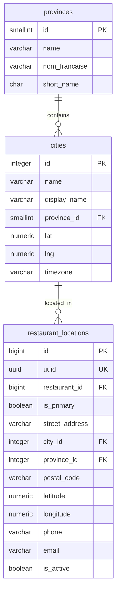
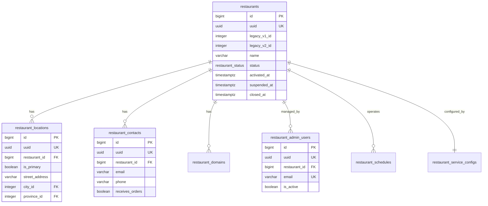
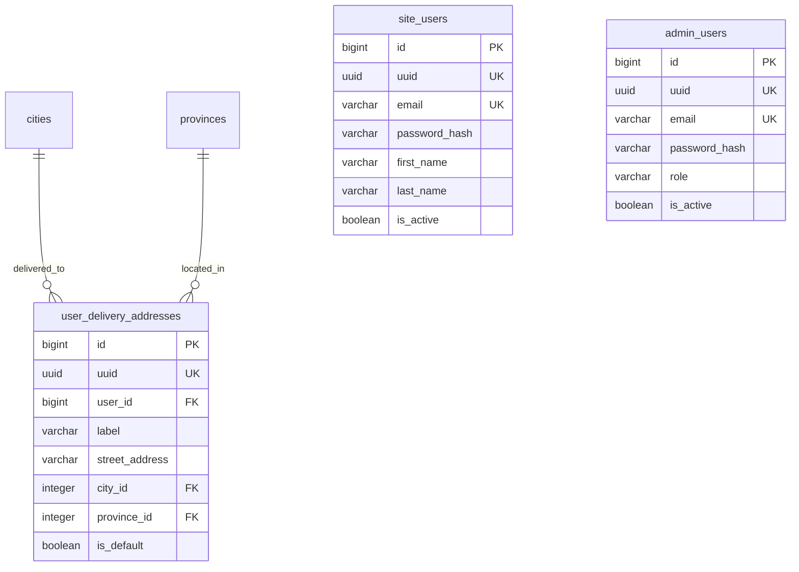
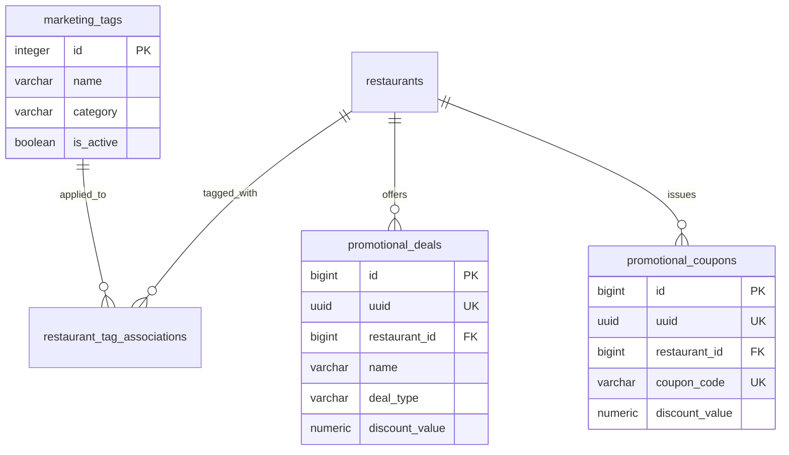

# menuca_v3 Database Schema Documentation

**Project:** menuca_v3 Database Migration  
**Purpose:** Complete visual and technical reference for menuca_v3 PostgreSQL schema  
**Database:** PostgreSQL 15+ on Supabase.com  
**Last Updated:** 2025-10-15

---

## 📑 Table of Contents

1. [Overview](#overview)
2. [Master Schema Diagram](#master-schema-diagram)
3. [Entity Diagrams](#entity-diagrams)
4. [Common Query Patterns](#common-query-patterns)
5. [Performance Tips](#performance-tips)
6. [Migration History](#migration-history)
7. [Schema Standards](#schema-standards)

---

## Overview

### Project Context

This schema represents the **brand new menuca_v3 application** - a complete rebuild from legacy menuca_v1 and menuca_v2 systems. This is not just a database migration; it's the foundation for a modern, well-architected application built on industry best practices.

### Key Facts

- **Total Entities:** 12 core business entities
- **Completed Entities:** 5/12 (41.7%)
- **Total Rows Migrated:** 153,498+ rows in production
- **Schema Type:** PostgreSQL with JSONB, UUIDs, and proper constraints
- **Deployment:** Supabase (hosted PostgreSQL)

### Entity Status Matrix

| Entity | Status | Tables | Rows | Completion Date |
|--------|--------|--------|------|-----------------|
| Location & Geography | ✅ Complete | 2 | ~140 | 2025-09-30 |
| Restaurant Management | ✅ Complete | 9 | 944+ restaurants | 2025-10-06 |
| Menu & Catalog | ✅ Complete | 8 | 121,149 | 2025-10-03 |
| Users & Access | ✅ Complete | 4 | 32,400+ | 2025-10-06 |
| Marketing & Promotions | ✅ Complete | 4 | 848 | 2025-10-08 |
| Orders & Checkout | 🔄 In Progress | TBD | - | - |
| Service Schedules | ⏳ Not Started | - | - | - |
| Delivery Operations | ⏳ Not Started | - | - | - |
| Payments | ⏳ Not Started | - | - | - |
| Accounting & Reporting | ⏳ Not Started | - | - | - |
| Vendors & Franchises | ⏳ Not Started | - | - | - |
| Devices & Infrastructure | ⏳ Not Started | - | - | - |

---

## Master Schema Diagram

This diagram shows all major entities and their relationships at a high level.

```mermaid
erDiagram
    %% ========== FOUNDATIONAL ENTITIES ==========
    provinces ||--o{ cities : "contains"
    
    %% ========== CORE RESTAURANT ENTITY ==========
    restaurants ||--o{ restaurant_locations : "has"
    restaurants ||--o{ restaurant_contacts : "has"
    restaurants ||--o{ restaurant_domains : "has"
    restaurants ||--o{ restaurant_admin_users : "managed_by"
    restaurants ||--|| restaurant_service_configs : "configured_by"
    restaurants ||--o{ restaurant_schedules : "operates"
    
    cities ||--o{ restaurant_locations : "located_in"
    
    %% ========== MENU & CATALOG ==========
    restaurants ||--o{ courses : "offers"
    restaurants ||--o{ dishes : "serves"
    restaurants ||--o{ ingredients : "stocks"
    restaurants ||--o{ ingredient_groups : "defines"
    restaurants ||--o{ combo_groups : "offers"
    
    courses ||--o{ dishes : "organizes"
    dishes ||--o{ dish_customizations : "allows"
    dishes ||--o{ dish_modifiers : "has"
    ingredient_groups ||--o{ ingredients : "contains"
    combo_groups ||--o{ combo_items : "contains"
    
    %% ========== ORDERS & CHECKOUT ==========
    restaurants ||--o{ orders : "receives"
    site_users ||--o{ orders : "places"
    orders ||--o{ order_items : "contains"
    dishes ||--o{ order_items : "ordered_as"
    
    %% ========== USERS & ACCESS ==========
    site_users ||--o{ user_delivery_addresses : "has"
    cities ||--o{ user_delivery_addresses : "delivered_to"
    
    %% ========== MARKETING & PROMOTIONS ==========
    restaurants ||--o{ restaurant_tag_associations : "tagged_with"
    marketing_tags ||--o{ restaurant_tag_associations : "applies_to"
    restaurants ||--o{ promotional_deals : "offers"
    restaurants ||--o{ promotional_coupons : "issues"
    
    %% ========== DELIVERY OPERATIONS ==========
    restaurants ||--o{ restaurant_delivery_areas : "delivers_to"
    cities ||--o{ restaurant_delivery_areas : "covers"

    provinces {
        smallint id PK
        varchar name
        char short_name
    }

    cities {
        integer id PK
        varchar name
        smallint province_id FK
        numeric lat
        numeric lng
    }

    restaurants {
        bigint id PK
        uuid uuid UK
        varchar name
        restaurant_status status
    }

    courses {
        integer id PK
        bigint restaurant_id FK
        varchar name
    }

    dishes {
        integer id PK
        bigint restaurant_id FK
        integer course_id FK
        varchar name
        jsonb prices
    }

    site_users {
        bigint id PK
        varchar email UK
        boolean is_active
    }

    orders {
        bigint id PK
        bigint restaurant_id FK
        bigint user_id FK
        numeric total_amount
    }
```



**Diagram Source:** [master_schema.mmd](./Mermaid_Diagrams/master_schema.mmd)

---

## Entity Diagrams

Detailed entity-relationship diagrams for each business domain.

### ✅ 1. Location & Geography

**Status:** COMPLETE (2025-09-30)  
**Purpose:** Canonical geography reference for all location-based tables



**Tables:**
- `menuca_v3.provinces` - 29 provinces/territories
- `menuca_v3.cities` - ~110-120 cities with geocoding

**Key Features:**
- Full geocoding support (lat/lng)
- IANA timezone data
- Bilingual support (English/French)
- Province validation

**Diagram Source:** [location_geography.mmd](./Mermaid_Diagrams/location_geography.mmd)

---

### ✅ 2. Restaurant Management

**Status:** COMPLETE (2025-10-06) + Status Correction (2025-10-14)  
**Purpose:** Core restaurant data, admin users, contacts, domains, schedules



**Tables:**
- `menuca_v3.restaurants` - 944 restaurants
- `menuca_v3.restaurant_locations` - Physical locations
- `menuca_v3.restaurant_contacts` - Contact information
- `menuca_v3.restaurant_domains` - Custom domain mappings
- `menuca_v3.restaurant_admin_users` - Admin access
- `menuca_v3.restaurant_schedules` - Operating hours
- `menuca_v3.restaurant_service_configs` - Service settings
- `menuca_v3.restaurant_special_schedules` - Holiday hours
- `menuca_v3.restaurant_time_periods` - Time-based pricing

**Status Correction (2025-10-14):**
- 101 restaurants corrected from suspended/pending → active
- Priority rule applied: "Active in EITHER V1 OR V2 → Active in V3"

**Diagram Source:** [restaurant_management.mmd](./Mermaid_Diagrams/restaurant_management.mmd)

---

### ✅ 3. Menu & Catalog

**Status:** COMPLETE (2025-10-03)  
**Purpose:** Complete menu structure with courses, dishes, ingredients, combos  
**Total Rows:** 121,149 (80,610 orphaned ghost records excluded)

```mermaid
erDiagram
    restaurants ||--o{ courses : "offers"
    restaurants ||--o{ dishes : "serves"
    restaurants ||--o{ ingredient_groups : "defines"
    restaurants ||--o{ ingredients : "stocks"
    restaurants ||--o{ combo_groups : "offers"

    courses ||--o{ dishes : "organizes"
    dishes ||--o{ dish_customizations : "allows"
    dishes ||--o{ dish_modifiers : "has"
    ingredient_groups ||--o{ ingredients : "contains"
    combo_groups ||--o{ combo_items : "contains"

    courses {
        integer id PK
        bigint restaurant_id FK
        varchar name
        integer display_order
    }

    dishes {
        integer id PK
        bigint restaurant_id FK
        integer course_id FK
        varchar name
        jsonb prices
        boolean is_available
    }

    ingredients {
        integer id PK
        bigint restaurant_id FK
        varchar name
    }

    dish_modifiers {
        integer dish_id PK FK
        integer ingredient_id PK FK
        jsonb prices
    }
```

**Tables:**
- `menuca_v3.courses` - 12,194 course categories
- `menuca_v3.dishes` - 42,930 menu items
- `menuca_v3.ingredients` - 45,176 ingredients
- `menuca_v3.ingredient_groups` - 9,572 ingredient groups
- `menuca_v3.combo_groups` - 12,576 combo meals
- `menuca_v3.combo_items` - 2,317 combo item links
- `menuca_v3.dish_customizations` - 310 customization rules
- `menuca_v3.dish_modifiers` - 8 modifier price overrides

**Key Achievements:**
- ✅ Phase 4 BLOB Deserialization: 144,377 BLOBs processed (98.6% success)
- ✅ Multi-size pricing: JSONB `{"sizes": [1.0, 1.5, 2.0]}`
- ✅ Availability schedules: Day-based restrictions
- ✅ Combo configurations: Complex combo rules preserved
- ✅ Excluded 80,610 orphaned records from 339 deleted restaurants

**Diagram Source:** [menu_catalog.mmd](./Mermaid_Diagrams/menu_catalog.mmd)

---

### ✅ 4. Users & Access

**Status:** COMPLETE (2025-10-06)  
**Purpose:** Customer accounts, admin users, delivery addresses



**Tables:**
- `menuca_v3.site_users` - 32,349 customer accounts
- `menuca_v3.user_delivery_addresses` - Delivery addresses
- `menuca_v3.admin_users` - 51 platform admins
- `menuca_v3.admin_user_restaurants` - 91 admin-restaurant assignments

**Diagram Source:** [users_access.mmd](./Mermaid_Diagrams/users_access.mmd)

---

### ✅ 5. Marketing & Promotions

**Status:** COMPLETE (2025-10-08)  
**Purpose:** Marketing tags, promotional deals, coupons  
**Total Rows:** 848



**Tables:**
- `menuca_v3.marketing_tags` - 36 marketing tags
- `menuca_v3.restaurant_tag_associations` - 29 tag assignments
- `menuca_v3.promotional_deals` - 202 promotional deals
- `menuca_v3.promotional_coupons` - 581 coupon codes

**Diagram Source:** [marketing_promotions.mmd](./Mermaid_Diagrams/marketing_promotions.mmd)

---

### 🔄 6. Orders & Checkout

**Status:** IN PROGRESS (Started: 2025-10-15)  
**Dependencies:** Menu ✅, Users ✅, Restaurant ✅

*Diagram will be finalized during migration*

**Diagram Source:** [orders_checkout.mmd](./Mermaid_Diagrams/orders_checkout.mmd)

---

### ⏳ Remaining Entities

Additional diagrams available but not yet migrated:

- [service_schedules.mmd](./Mermaid_Diagrams/service_schedules.mmd) - Service Configuration & Schedules
- [delivery_operations.mmd](./Mermaid_Diagrams/delivery_operations.mmd) - Delivery Operations
- [payments.mmd](./Mermaid_Diagrams/payments.mmd) - Payments
- [accounting_reporting.mmd](./Mermaid_Diagrams/accounting_reporting.mmd) - Accounting & Reporting
- [vendors_franchises.mmd](./Mermaid_Diagrams/vendors_franchises.mmd) - Vendors & Franchises
- [devices_infrastructure.mmd](./Mermaid_Diagrams/devices_infrastructure.mmd) - Devices & Infrastructure

---

## Common Query Patterns

### Location Queries

**Find all restaurants in a city:**
```sql
SELECT r.name, rl.street_address
FROM menuca_v3.restaurants r
JOIN menuca_v3.restaurant_locations rl ON r.id = rl.restaurant_id
JOIN menuca_v3.cities c ON rl.city_id = c.id
WHERE c.name = 'Toronto'
  AND r.status = 'active'
  AND rl.is_active = true;
```

**Get restaurant with full location details:**
```sql
SELECT 
  r.name,
  rl.street_address,
  c.name AS city,
  p.name AS province,
  rl.latitude,
  rl.longitude,
  c.timezone
FROM menuca_v3.restaurants r
JOIN menuca_v3.restaurant_locations rl ON r.id = rl.restaurant_id
JOIN menuca_v3.cities c ON rl.city_id = c.id
JOIN menuca_v3.provinces p ON c.province_id = p.id
WHERE r.id = 123;
```

---

### Menu Queries

**Get restaurant's menu with courses:**
```sql
SELECT 
  c.name AS course_name,
  d.name AS dish_name,
  d.prices,
  d.is_available
FROM menuca_v3.courses c
LEFT JOIN menuca_v3.dishes d ON c.id = d.course_id
WHERE c.restaurant_id = 123
  AND c.is_global = false
ORDER BY c.display_order, d.display_order;
```

**Get dish with all modifiers:**
```sql
SELECT 
  d.name AS dish_name,
  ig.name AS modifier_group,
  i.name AS modifier_name,
  dm.prices AS modifier_prices
FROM menuca_v3.dishes d
JOIN menuca_v3.dish_modifiers dm ON d.id = dm.dish_id
JOIN menuca_v3.ingredients i ON dm.ingredient_id = i.id
JOIN menuca_v3.ingredient_groups ig ON i.ingredient_group_id = ig.id
WHERE d.id = 456
ORDER BY ig.display_order, i.display_order;
```

**Extract multi-size pricing:**
```sql
SELECT 
  name,
  prices->>'default' AS default_price,
  prices->'sizes'->0 AS small_price,
  prices->'sizes'->1 AS medium_price,
  prices->'sizes'->2 AS large_price
FROM menuca_v3.dishes
WHERE restaurant_id = 123;
```

---

### User Queries

**Get user with all delivery addresses:**
```sql
SELECT 
  u.email,
  u.first_name,
  u.last_name,
  uda.label,
  uda.street_address,
  c.name AS city,
  p.short_name AS province,
  uda.is_default
FROM menuca_v3.site_users u
LEFT JOIN menuca_v3.user_delivery_addresses uda ON u.id = uda.user_id
LEFT JOIN menuca_v3.cities c ON uda.city_id = c.id
LEFT JOIN menuca_v3.provinces p ON c.province_id = p.id
WHERE u.email = 'customer@example.com'
  AND uda.is_active = true;
```

---

### Restaurant Management Queries

**Get restaurant with all admin users:**
```sql
SELECT 
  r.name AS restaurant_name,
  rau.email,
  rau.first_name,
  rau.last_name,
  rau.is_active
FROM menuca_v3.restaurants r
JOIN menuca_v3.restaurant_admin_users rau ON r.id = rau.restaurant_id
WHERE r.id = 123
  AND rau.is_active = true;
```

**Check restaurant operating hours:**
```sql
SELECT 
  r.name,
  rs.type AS service_type,
  rs.day_start,
  rs.day_stop,
  rs.time_start,
  rs.time_stop,
  rs.is_enabled
FROM menuca_v3.restaurants r
JOIN menuca_v3.restaurant_schedules rs ON r.id = rs.restaurant_id
WHERE r.id = 123
  AND rs.is_enabled = true
ORDER BY rs.type, rs.day_start;
```

---

## Performance Tips

### Indexing Strategy

**Primary Indexes (already applied):**
- All `id` columns (Primary Keys)
- All `uuid` columns (Unique Keys)
- All Foreign Key columns
- Email columns (Unique constraints)

**JSONB Indexes:**
```sql
-- GIN index for JSONB price queries
CREATE INDEX idx_dishes_prices_gin ON menuca_v3.dishes USING GIN (prices);

-- Extract specific JSONB fields
CREATE INDEX idx_dishes_default_price 
  ON menuca_v3.dishes ((prices->>'default'));
```

**Composite Indexes:**
```sql
-- Restaurant + Status filtering
CREATE INDEX idx_restaurants_status_active 
  ON menuca_v3.restaurants (status) 
  WHERE status = 'active';

-- City + Restaurant lookups
CREATE INDEX idx_restaurant_locations_city_restaurant 
  ON menuca_v3.restaurant_locations (city_id, restaurant_id) 
  WHERE is_active = true;
```

---

### Query Optimization

**Use EXPLAIN ANALYZE:**
```sql
EXPLAIN ANALYZE
SELECT * FROM menuca_v3.dishes
WHERE restaurant_id = 123 AND is_available = true;
```

**Avoid N+1 Queries:**
```sql
-- ❌ BAD: Separate queries for each dish's modifiers
SELECT * FROM dishes WHERE restaurant_id = 123;
-- Then for each dish: SELECT * FROM dish_modifiers WHERE dish_id = ?

-- ✅ GOOD: Single JOIN query
SELECT d.*, dm.*, i.name
FROM dishes d
LEFT JOIN dish_modifiers dm ON d.id = dm.dish_id
LEFT JOIN ingredients i ON dm.ingredient_id = i.id
WHERE d.restaurant_id = 123;
```

**Pagination Best Practices:**
```sql
-- ✅ Use cursor-based pagination for large datasets
SELECT * FROM menuca_v3.dishes
WHERE id > :last_id
ORDER BY id
LIMIT 50;
```

---

### JSONB Performance

**Query JSONB efficiently:**
```sql
-- ✅ Use operators for existence checks
SELECT * FROM dishes WHERE prices ? 'default';

-- ✅ Use @> for containment queries
SELECT * FROM dishes WHERE prices @> '{"sizes": [10.99]}';

-- ❌ Avoid casting unless necessary
SELECT * FROM dishes WHERE (prices->>'default')::numeric > 15.00;
```

---

## Migration History

### Phase 1: Location & Geography ✅
- **Date:** 2025-09-30
- **Developer:** Brian Lapp
- **Tables:** provinces, cities
- **Rows:** ~140
- **Status:** COMPLETE

**Key Achievements:**
- V2 data as authoritative source
- V1 backfill for missing cities
- Timezone derivation from provinces
- 100% coordinate validation

---

### Phase 2: Restaurant Management ✅
- **Date:** 2025-10-06
- **Developer:** Team
- **Tables:** 9 restaurant tables
- **Rows:** 944 restaurants + related records
- **Status:** COMPLETE

**Key Achievements:**
- Unified V1 and V2 restaurant data
- Custom domain mappings preserved
- Admin user consolidation

**Status Correction (2025-10-14):**
- Identified V2 data overwrite issue
- Corrected 101 restaurants to active status
- Applied priority rule: "Active in V1 OR V2 → Active in V3"

---

### Phase 3: Menu & Catalog ✅
- **Date:** 2025-10-03
- **Developer:** Brian Lapp
- **Tables:** 8 menu tables
- **Rows:** 121,149 (excluding 80,610 orphaned)
- **Status:** COMPLETE

**Key Achievements:**
- Phase 4 BLOB Deserialization: 144,377 BLOBs processed (98.6% success)
- Multi-size pricing system
- Combo configurations preserved
- Day-based availability schedules
- Excluded 339 deleted ghost restaurants

**Technical Highlights:**
- PHP serialized BLOB → JSONB transformation
- V1 column mapping correction (52,305 ingredients)
- Missing ingredient groups crisis resolved (10,810 groups added)
- SQL escaping fixes (`\'` → `''`)

---

### Phase 4: Users & Access ✅
- **Date:** 2025-10-06
- **Developer:** Team
- **Tables:** 4 user tables
- **Rows:** 32,400+
- **Status:** COMPLETE

**Key Achievements:**
- Customer accounts migrated
- Platform admin consolidation
- Delivery address validation

---

### Phase 5: Marketing & Promotions ✅
- **Date:** 2025-10-08
- **Developer:** Team
- **Tables:** 4 marketing tables
- **Rows:** 848
- **Status:** COMPLETE

**Key Achievements:**
- Marketing tags migrated
- Promotional deals preserved
- Coupon codes validated

---

### Phase 6: V3 Schema Optimization ✅
- **Date:** 2025-10-14
- **Developer:** Brian Lapp
- **Status:** COMPLETE (All 5 Phases)

**Optimization Summary:**
1. ✅ **Admin Table Consolidation** - 3→2 tables, 456 unified admins
2. ✅ **Table Archival** - 2 legacy tables archived (1,265 rows)
3. ✅ **Constraints** - 14 NOT NULL constraints added
4. ✅ **Column Renaming** - 17 columns follow conventions
5. ✅ **JSONB → Relational** - 7,502 price records migrated (99.85% success)

---

## Schema Standards

### Naming Conventions

**Tables:**
- Singular nouns: `restaurant`, `dish`, `user`
- Junction tables: `entity1_entity2` (e.g., `admin_user_restaurants`)
- Lowercase with underscores

**Columns:**
- `id` - Primary key (bigint, integer, smallint)
- `uuid` - Unique UUID (uuid type)
- `*_id` - Foreign keys
- `is_*` - Boolean flags (NOT `enabled`, `active` without prefix)
- `*_at` - Timestamps (NOT `*_date`, `*_time` for timestamps)
- `created_at`, `updated_at` - Standard audit fields
- `created_by`, `updated_by` - User tracking

**Constraints:**
- Primary Key: `{table}_pkey`
- Foreign Key: `{table}_{column}_fkey`
- Unique: `{table}_{column}_key`
- Check: `{table}_{column}_check`

---

### Data Types

**Standard Types:**
- `bigint` - Large IDs (restaurants, users, orders)
- `integer` - Medium IDs (dishes, courses)
- `smallint` - Small IDs (provinces)
- `uuid` - Universal unique identifiers
- `varchar` - Variable text (specify length if constrained)
- `text` - Long text (descriptions, notes)
- `numeric` - Exact decimals (prices, amounts)
- `boolean` - True/false flags
- `timestamptz` - Timestamps with timezone
- `date` - Dates only
- `time` - Times only
- `jsonb` - JSON data (use GIN indexes)

**Avoid:**
- `char` except for fixed-length codes
- `timestamp` without timezone
- `float`/`real` for money

---

### JSONB Standards

**Pricing Format:**
```json
{
  "default": 14.99,
  "sizes": [10.99, 14.99, 18.99]
}
```

**Availability Schedule:**
```json
{
  "sunday": false,
  "monday": true,
  "tuesday": true,
  "wednesday": true,
  "thursday": true,
  "friday": true,
  "saturday": true
}
```

**Combo Configuration:**
```json
{
  "itemcount": "2",
  "ci": {
    "has": "Y",
    "min": "1",
    "max": "1"
  }
}
```

---

### Audit Fields

All major tables include:
```sql
created_at timestamp with time zone NOT NULL DEFAULT now(),
created_by integer,
updated_at timestamp with time zone,
updated_by integer
```

---

### Status Enums

**Restaurant Status:**
- `pending` - Awaiting activation
- `active` - Operational
- `suspended` - Temporarily disabled
- `closed` - Permanently closed

**Order Status:**
- `pending` - Order placed
- `confirmed` - Restaurant confirmed
- `preparing` - Being prepared
- `ready` - Ready for pickup/delivery
- `delivered` - Completed
- `cancelled` - Cancelled

---

## Additional Resources

### Project Files
- [Memory Bank](../MEMORY_BANK/README.md) - Project status and entity tracking
- [ETL Methodology](../MEMORY_BANK/ETL_METHODOLOGY.md) - Migration process
- [Project Status](../MEMORY_BANK/PROJECT_STATUS.md) - Current progress

### Mermaid Diagrams
- [Diagram Directory](./Mermaid_Diagrams/) - All `.mmd` source files
- [MermaidChart.com](https://www.mermaidchart.com/) - Interactive diagram editing

### Schema Files
- [menuca_v3.sql](./Schemas/menuca_v3.sql) - Complete V3 schema
- [V3 Table Audit](./V3_COMPLETE_TABLE_AUDIT.md) - Detailed table analysis

---

**Maintained By:** Brian Lapp (Junior Developer)  
**Project:** menuca_v3 Database Migration to Supabase  
**Last Updated:** 2025-10-15

