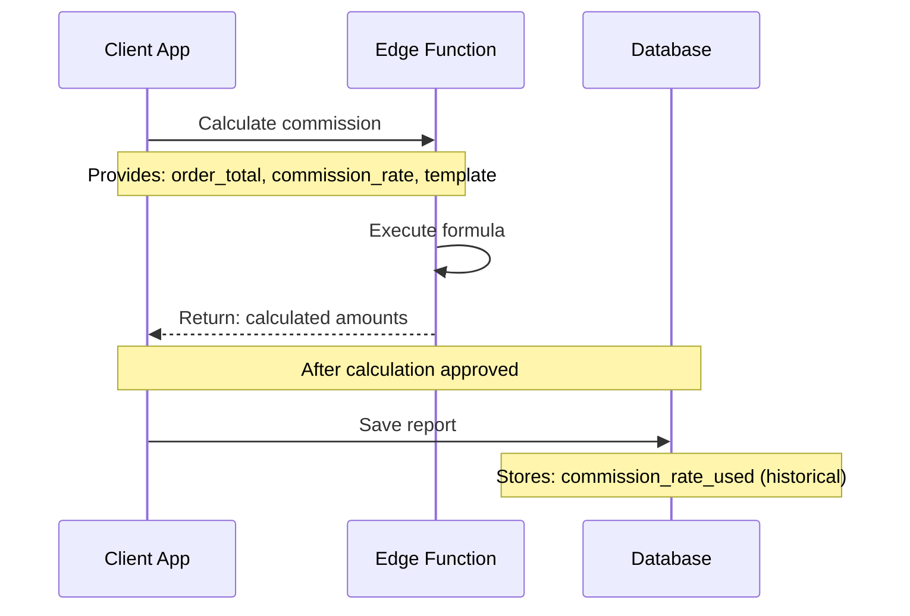

# Commission Rate Architecture: Dynamic Client-Provided Model

**Last Updated:** October 15, 2025  
**Status:** Implemented and Verified ✅

---

## 🎯 Core Principle

**Commission rates are DYNAMIC and provided by the client at calculation time.**

They are:
- ❌ NOT stored in the database as configuration
- ❌ NOT queried by the Edge Function
- ✅ PROVIDED by the client when calling the Edge Function
- ✅ TRACKED historically in report records after calculation

---

## 🔄 How It Works

### Business Reality

Commission rates vary:
- **Per Restaurant:** Different restaurants have different rates
- **Per Month:** Same restaurant can have different rates each month
- **Per Agreement:** Rates change based on contracts/negotiations

**Example:**
```
Restaurant: River Pizza
- January 2025:  10% commission
- February 2025: 15% commission (special promotion)
- March 2025:    12% commission (new contract)
```

### Technical Implementation



---

## 📊 Database Schema

### `menuca_v3.vendor_restaurants`

**Purpose:** Track which vendor manages which restaurant

```sql
CREATE TABLE menuca_v3.vendor_restaurants (
    id UUID PRIMARY KEY,
    vendor_id UUID NOT NULL REFERENCES menuca_v3.vendors(id),
    restaurant_uuid UUID NOT NULL REFERENCES menuca_v3.restaurants(uuid),
    commission_template TEXT NOT NULL,  -- 'percent_commission' or 'mazen_milanos'
    
    -- NO commission_rate column (it's dynamic!)
    -- NO commission_type column (it's dynamic!)
    
    is_active BOOLEAN DEFAULT true,
    assignment_start_date DATE,
    assignment_end_date DATE,
    created_at TIMESTAMPTZ DEFAULT NOW(),
    updated_at TIMESTAMPTZ DEFAULT NOW()
);
```

**What's Stored:**
- ✅ Vendor-restaurant relationship
- ✅ Which commission formula to use (`commission_template`)
- ✅ Active/inactive status
- ✅ Assignment date range

**What's NOT Stored:**
- ❌ Commission rate (dynamic, provided by client)
- ❌ Commission type (dynamic, provided by client)
- ❌ Fixed fees (part of formula, hardcoded in Edge Function)

---

### `menuca_v3.vendor_commission_reports`

**Purpose:** Historical record of generated commission reports

```sql
CREATE TABLE menuca_v3.vendor_commission_reports (
    id UUID PRIMARY KEY,
    vendor_id UUID NOT NULL,
    restaurant_uuid UUID NOT NULL,
    statement_number INTEGER NOT NULL,
    
    -- Report period
    report_period_start DATE NOT NULL,
    report_period_end DATE NOT NULL,
    
    -- Calculation details
    calculation_template TEXT NOT NULL,           -- Which formula was used
    calculation_input JSONB,                      -- Input parameters
    calculation_result JSONB,                     -- Output from Edge Function
    
    -- Amounts
    total_order_amount DECIMAL(10,2),
    vendor_commission_amount DECIMAL(10,2),
    platform_fee_amount DECIMAL(10,2),
    
    -- HISTORICAL commission rate (what was actually used)
    commission_rate_used DECIMAL(10,2),           -- ← Captured at calculation time
    commission_type_used commission_rate_type,     -- ← Captured at calculation time
    
    -- Report metadata
    report_status TEXT DEFAULT 'draft',
    report_generated_at TIMESTAMPTZ,
    pdf_file_url TEXT,
    sent_at TIMESTAMPTZ,
    paid_at TIMESTAMPTZ,
    
    created_at TIMESTAMPTZ DEFAULT NOW(),
    metadata JSONB
);
```

**Key Fields:**
- ✅ `commission_rate_used`: Historical record of the rate used in THIS calculation
- ✅ `commission_type_used`: Historical record of the type used
- ✅ `calculation_input`: Full input parameters sent to Edge Function
- ✅ `calculation_result`: Full output from Edge Function

**Purpose:** Audit trail and historical reference

---

## 🔧 Edge Function API

### Endpoint
```
POST /functions/v1/calculate-vendor-commission
```

### Request Format

#### Percent Commission Template
```json
{
  "template": "percent_commission",
  "data": {
    "order_total": 10000.00,
    "commission": 15,              // ← Client provides this
    "commission_type": "percentage", // ← Client provides this
    "menuottawa_share": 80.00
  }
}
```

#### Mazen Milanos Template
```json
{
  "template": "mazen_milanos",
  "data": {
    "order_total": 10000.00,
    "restaurant_commission": 12,  // ← Client provides this
    "menuottawa_share": 80.00
  }
}
```

### Response Format
```json
{
  "template": "percent_commission",
  "totalCommission": 1500.00,
  "forVendor": 710.00,
  "forMenuca": 710.00,
  "forMenucaTotal": 790.00
}
```

---

## 💼 Workflow Example

### Monthly Report Generation Process

```javascript
// Step 1: Get vendor-restaurant assignments
const assignments = await supabase
  .from('vendor_restaurants')
  .select(`
    id,
    vendor_id,
    restaurant_uuid,
    commission_template
  `)
  .eq('vendor_id', vendorId)
  .eq('is_active', true);

// Step 2: For each restaurant, get order total for the month
for (const assignment of assignments) {
  const orderTotal = await getMonthlyOrderTotal(
    assignment.restaurant_uuid,
    '2025-01-01',
    '2025-01-31'
  );
  
  // Step 3: Client determines commission rate
  // (from contract, negotiation, configuration file, etc.)
  const commissionRate = getCommissionRateForRestaurant(
    assignment.restaurant_uuid,
    '2025-01'  // Month
  );
  
  // Step 4: Call Edge Function with rate
  const calculation = await fetch('/functions/v1/calculate-vendor-commission', {
    method: 'POST',
    body: JSON.stringify({
      template: assignment.commission_template,
      data: {
        order_total: orderTotal,
        commission: commissionRate,      // ← Dynamic rate
        commission_type: 'percentage',
        menuottawa_share: 80.00
      }
    })
  });
  
  const result = await calculation.json();
  
  // Step 5: Save report with ACTUAL rate used
  await supabase
    .from('vendor_commission_reports')
    .insert({
      vendor_id: assignment.vendor_id,
      restaurant_uuid: assignment.restaurant_uuid,
      statement_number: nextStatementNumber,
      report_period_start: '2025-01-01',
      report_period_end: '2025-01-31',
      calculation_template: assignment.commission_template,
      calculation_input: {
        order_total: orderTotal,
        commission: commissionRate,
        commission_type: 'percentage'
      },
      calculation_result: result,
      total_order_amount: orderTotal,
      vendor_commission_amount: result.forVendor,
      platform_fee_amount: 80.00,
      commission_rate_used: commissionRate,     // ← Store historical rate
      commission_type_used: 'percentage',
      report_status: 'generated',
      report_generated_at: new Date()
    });
}
```

---

## 📋 Where Commission Rates Come From

Since rates are NOT in the database, they must come from:

### Option 1: Configuration File
```typescript
// config/commission-rates.ts
export const commissionRates = {
  '2025-01': {
    'restaurant-uuid-1': { rate: 10, type: 'percentage' },
    'restaurant-uuid-2': { rate: 12, type: 'percentage' },
    'restaurant-uuid-3': { rate: 150, type: 'fixed' }
  },
  '2025-02': {
    'restaurant-uuid-1': { rate: 15, type: 'percentage' },  // Changed!
    'restaurant-uuid-2': { rate: 12, type: 'percentage' },
    'restaurant-uuid-3': { rate: 150, type: 'fixed' }
  }
};
```

### Option 2: External Service
```typescript
const rate = await commissionRateService.getRate({
  restaurantId,
  month: '2025-01'
});
```

### Option 3: Separate Configuration Table
```sql
CREATE TABLE commission_configurations (
    restaurant_uuid UUID,
    effective_month DATE,
    commission_rate DECIMAL(10,2),
    commission_type commission_rate_type,
    notes TEXT
);

-- Query at runtime
SELECT commission_rate, commission_type
FROM commission_configurations
WHERE restaurant_uuid = $1
  AND effective_month = $2;
```

### Option 4: Manual Entry (UI)
```
[Generate Report UI]
Restaurant: River Pizza
Month: January 2025
Order Total: $10,000.00

Commission Rate: [15] [%] ← User enters manually

[Calculate] [Generate Report]
```

---

## ✅ Benefits of This Architecture

### 1. **Flexibility**
- ✅ Rates can change monthly without schema changes
- ✅ Different rate sources can be used
- ✅ Easy to implement promotional rates

### 2. **Accuracy**
- ✅ Client provides exact rate for specific calculation
- ✅ No risk of stale database values
- ✅ Historical rates preserved in report records

### 3. **Simplicity**
- ✅ Edge Function is stateless
- ✅ No complex rate lookup logic
- ✅ Clear separation of concerns

### 4. **Audit Trail**
- ✅ Every report records the exact rate used
- ✅ Can verify calculations retroactively
- ✅ Historical analysis possible

---

## 🚫 What NOT To Do

### ❌ Don't Query Database in Edge Function
```typescript
// BAD - Don't do this!
async function calculateCommission(data) {
  // DON'T query database for rate
  const { commission_rate } = await supabase
    .from('vendor_restaurants')
    .select('commission_rate')
    .eq('id', data.assignment_id)
    .single();
  
  // Edge Function should be stateless!
}
```

### ❌ Don't Trust "Current" Rate in Database
```typescript
// BAD - Don't assume this is accurate
const assignment = await getAssignment(restaurantId);
const rate = assignment.commission_rate;  // ← Might be outdated!
```

### ❌ Don't Hard-Code Rates in Application
```typescript
// BAD - Inflexible
if (restaurantId === 'xyz') {
  commission_rate = 10;
} else if (restaurantId === 'abc') {
  commission_rate = 12;
}
```

---

## ✅ Best Practices

### 1. **Always Provide Rate Explicitly**
```typescript
// GOOD
await calculateCommission({
  template: 'percent_commission',
  data: {
    order_total: total,
    commission: explicitRate,  // ← Always provide
    commission_type: 'percentage'
  }
});
```

### 2. **Store Rate in Report**
```typescript
// GOOD - Preserve historical rate
await saveReport({
  // ... other fields
  commission_rate_used: rateUsedInCalculation,
  calculation_input: fullInputParameters
});
```

### 3. **Document Rate Source**
```typescript
// GOOD - Track where rate came from
metadata: {
  rate_source: 'monthly_config_file',
  rate_approved_by: 'manager@example.com',
  rate_effective_date: '2025-01-01'
}
```

---

## 📊 Migration Notes

### Schema Changes Applied

1. **Removed from `vendor_restaurants`:**
   - ❌ `commission_rate` column
   - ❌ `commission_type` column
   - ❌ `fixed_platform_fee` column
   - ❌ `delivery_commission_extra` column

2. **Added to `vendor_commission_reports`:**
   - ✅ `commission_rate_used` column (historical)
   - ✅ `commission_type_used` column (historical)

3. **Updated Views:**
   - ✅ `v_active_vendor_restaurants` - removed rate fields
   - ✅ `v_vendor_report_summary` - unchanged (doesn't use rates)

### Data Migration

- All existing V2 reports were updated with `commission_rate_used = 10.0` (V2 default)
- `metadata->>'needs_commission_rate_review'` flag removed (no longer needed)

---

## 🎯 Summary

**Key Takeaway:** Commission rates are runtime parameters, not database configuration.

```
Database stores: "Use percent_commission formula"
Client provides: "With 15% commission rate"
Edge Function: Calculates and returns result
Report stores: "This report used 15% rate" (historical record)
```

This architecture provides maximum flexibility while maintaining a complete audit trail.


